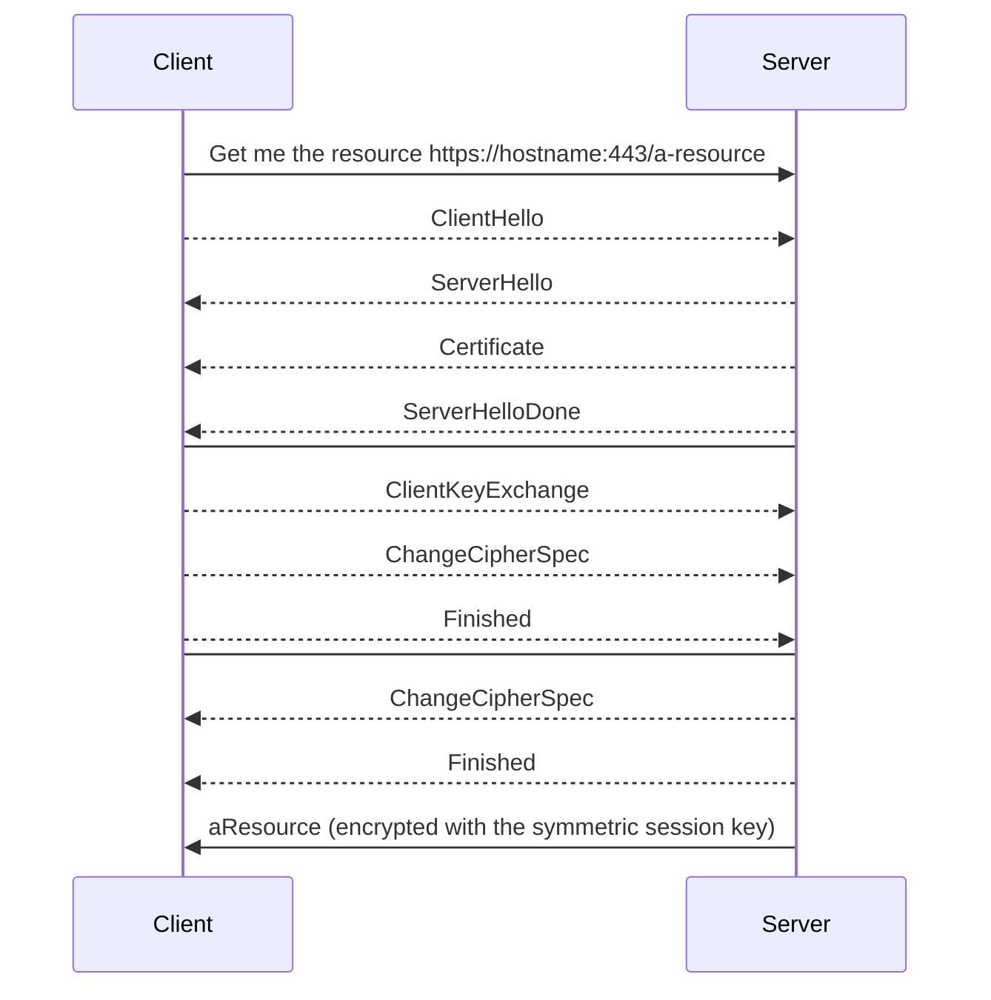
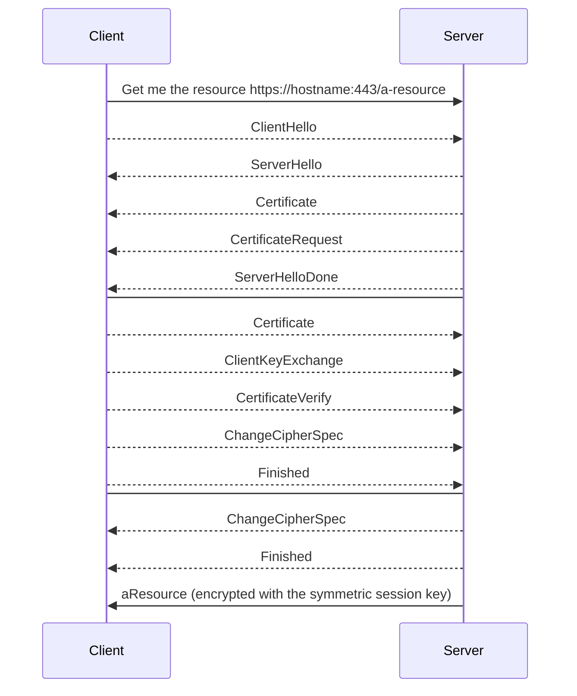

# curl-ssl-authentication
Describes how to use cURL to make calls to (Mutual) SSL (both 1-way and 2-way) Authentication enabled server URLs(HTTPS- enabled)

# cURL with SSL Authentication and Mutual SSL Authentication

This article is to describe how SSL Authentication works and how cURL can be used to make calls to web resources hosted behind HTTPS protocol.


# SSL Authentication

As part of SSL Authentication (aka 1-way SSL Authentication), the client is presented a certificate by server. Client verifies if the Certificate Authority(CA) of the server's certificate is one of its trusted CAs or not. If trusted, the client then verifies if the certificate is not tampered with.

## Message exchanges between client and server to establish a secure channel for communication

Basic Flow:
1. A client requests access to a protected resource.
2. The server presents its certificate to the client.
3. The client verifies the server's certificate.
4. If successful, the server grants access to the protected resource requested by the client.

a. Client sends **ClientHello** message proposing SSL options.
b. Server response with **ServeHello** message selecting the SSL options.
c. Server sends **Certificate** message, which contains the server's certificate (which contains the public key and other information).
d. Server concludes its part if the negotiation with **ServerHelloDone** message.
e. Client sends session key information (encrypted with sever's public key) in **ClientKeyExchange** message.
f. Client sends **ChangeCipherSpec** message to activate the negotiated options for all future messages it will send.
g. Client sends **Finished** message to let the server check the newly activated options.
h. Server sends **ChangeCipherSpec** message to activate the negotiated options for all future messages it will send.
i. Server sends **Finished** message to let the client heh the newly activated options.

## cURL with SSL Authentication

Curl does not support a combined file with keys and certificates so I had to extract and convert this data to pem format which is a format that works with curl. To extract the keys and certificates I used [OpenSSL](http://www.openssl.org/) and executed following commands in my terminal:
```
openssl x509 -inform DES -in file1.cer -out file1.pem -text

To convert cert file into pem
```
```
curl --cacert file1.pem -u user:passwd -X GET -H 'Content-Type: application/json' "https//somesecureserver.com/rest/field"

Cert to be trusted is specified using --cacert option

-k or --insecure option can also be used to ignore the verification of server provided CA certificate, in which case the curl command will be:

curl -k -u user:passwd -X GET -H 'Content-Type: application/json' "https//somesecureserver.com/rest/field"
```


# Mutual SSL Authentication

Mutual SSL authentication(aka 2-way SSL Authentication) refers to two client and server authenticating each other through providing digital certificate so that both parties are assured of the others' identity.

## Message exchanges between client and server to establish a secure channel for communication

Basic Flow:
1. A client requests access to a protected resource.
2. The server presents its certificate to the client.
3. The client verifies the server's certificate.
4. If successful, the client sends its certificate to the server.
5. Tje server verifies the client's certificate.
6. If successful, the server grants access to the protected resource requested by the client.

a. Client sends **ClientHello** message proposing SSL options.
b. Server response with **ServeHello** message selecting the SSL options.
c. Server sends **Certificate** message, which contains the server's certificate (which contains the public key and other information).
d. Server requests client's certificate in **CertificateRequest** message, so that the connection can be mutually authenticated.
e. Server concludes its part if the negotiation with **ServerHelloDone** message.
f. Client responds with **Certificate** message, which contains the client's certificate(which contains its public key and other information about client).
g. Client sends session key information (encrypted with sever's public key) in **ClientKeyExchange** message.
h. Client sends a **CertificateVerify** message to lt the server know it owns the sent certificate.
i. Client sends **ChangeCipherSpec** message to activate the negotiated options for all future messages it will send.
j. Client sends **Finished** message to let the server check the newly activated options.
k. Server sends **ChangeCipherSpec** message to activate the negotiated options for all future messages it will send.
l. Server sends **Finished** message to let the client heh the newly activated options.

## cURL with SSL Authentication

Curl does not support a combined file with keys and certificates so I had to extract and convert this data to pem format which is a format that works with curl. To extract the keys and certificates I used [OpenSSL](http://www.openssl.org/) and executed following commands in my terminal:
```
If you have a JKS, then convert it only PKCS12:

keytool -importkeystore -srckeystore my.jks -srcstoretype JKS -deststoretype PKCS12 -destkeystore my.p12

PKS12 -> JKS

keytool -importkeystore -srckeystore my.p12 -srcstoretype PKCS12 -deststoretype JKS -destkeystore my.jks
```
```
openssl pkcs12 -in my.p12 -out ca.pem -cacerts –nokeys

To extract CA certificate from my.p12 to ca.pem
```
```
openssl pkcs12 -in my.p12 -out client.pem -clcerts -nokeys

To extract Client certificates from my.p12 to client.pem
```
```
openssl pkcs12 -in my.p12 -out key.pem -nocerts

To extract private key from my.p12 to key.pem
```
```
curl –-cert client.pem:<password> --key key.pem –-cacert ca.pem -u user:passwd -X GET -H 'Content-Type: application/json' "https//somesecureserver.com/rest/field"

Cert to be trusted is specified using --cacert option
Cert to be provided by client is specified by using --cert
Private key of the client cert is specified by --key

-k or --insecure option can also be used to ignore the verification of server provided CA certificate, in which case the curl command will be:

curl –-cert client.pem:<password> --key key.pem -k -u user:passwd -X GET -H 'Content-Type: application/json' "https//somesecureserver.com/rest/field"
```

# Debugging SSL/TLS Connections in Java applications
You can use the following as a java argument when starting a standalone Java client.
```
-Djavax.net.debug=ssl,handshake

all            turn on all debugging
ssl            turn on ssl debugging

The following can be used with ssl:
    record       enable per-record tracing
    handshake    print each handshake message
    keygen       print key generation data
    session      print session activity
    defaultctx   print default SSL initialization
    sslctx       print SSLContext tracing
    sessioncache print session cache tracing
    keymanager   print key manager tracing
    trustmanager print trust manager tracing
    pluggability print pluggability tracing

    handshake debugging can be widened with:
    data         hex dump of each handshake message
    verbose      verbose handshake message printing

    record debugging can be widened with:
    plaintext    hex dump of record plaintext
    packet       print raw SSL/TLS packets
```
If you want to monitor security access, you can set the `java.security.debug` System property.
```
-Djava.security.debug=access:stack

For more access: [https://docs.oracle.com/javase/8/docs/technotes/guides/security/troubleshooting-security.html](https://docs.oracle.com/javase/8/docs/technotes/guides/security/troubleshooting-security.html)
```
Sample in Java command to run a Spring Boot applications with above enabled properties.
```
java -Djavax.net.debug=ssl:handshake:verbose:keymanager:trustmanager -Djava.security.debug=access:stack  -jar myspringboot-1.0.1.jar
```
